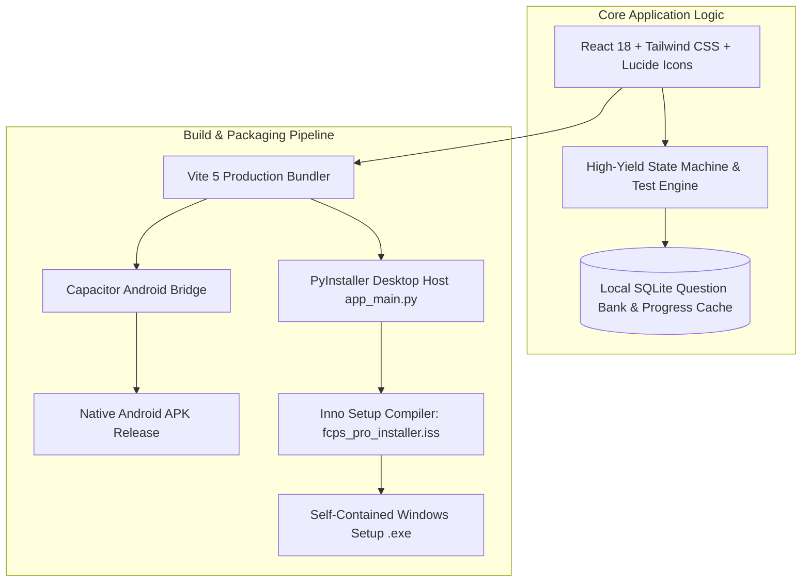

# 🏥 FCPS Pro — Enterprise Medical Postgraduate Examination & Clinical QBank Suite

<div align="center">

[](https://react.dev)
[](https://vitejs.dev)
[](https://capacitorjs.com)
[](#)
[](https://sqlite.org)
[](LICENSE)
[](https://github.com/muhammadokashapak)

<p align="center">
  <strong>Multi-Platform Postgraduate Medical Examination Engine for FCPS Part 1 & Part 2 Aspirants with Native Android and Windows Packaging</strong>
</p>

[📖 Overview](#-overview) •
[📱 Cross-Platform Architecture](#-cross-platform-architecture) •
[🌟 Core Features](#-core-features) •
[📂 Directory Structure](#-directory-structure) •
[🚀 Installation & Build](#-installation--build-guide) •
[👨‍💻 Author](#-author--connect)

---

</div>

## 📖 Overview

The **Fellow of the College of Physicians and Surgeons (FCPS)** examination is one of the most demanding medical postgraduate credentialing tests in South Asia. Passing Part 1 requires rapid diagnostic pattern recognition, mastery over thousands of high-yield clinical vignettes, and stringent time management under pressure.

**FCPS Pro** is an enterprise-grade medical examination testing suite engineered to provide medical graduates with an immersive, distraction-free environment. Packaged for both native **Android smartphones/tablets** (via Capacitor) and **Windows Desktop** (via PyInstaller & Inno Setup), it offers instant offline access to extensive clinical question banks across all core medical specializations.

---

## 📱 Cross-Platform Architecture



---

## 🌟 Core Features

- 📚 **Comprehensive Categorized QBank:** Thousands of curated Single-Best-Answer (SBA) questions spanning:
  - **Anatomy:** Embryology, Neuroanatomy, Histology, Gross Anatomy.
  - **Physiology:** Cardiovascular, Respiratory, Renal, Neurophysiology, Endocrine.
  - **Pathology:** General Neoplasia, Hematology, Microbiology, Immunology.
  - **Pharmacology:** Autonomic, Chemotherapeutic, Antimicrobial, Toxicology.
  - **Specialty Tracks:** Surgery & Allied, Medicine & Allied, Gynecology/Obstetrics.
- ⏱️ **Official CPSP Exam Simulation:** Real-time countdown timer, question matrix grid, unattempted question alerts, and instant score summaries.
- 💡 **Evidence-Based Explanations:** Deep clinical rationales citing standard medical reference textbooks (Snell, Guyton, Robbins, Katzung).
- 📊 **Performance Analytics & Weak Area Heatmaps:** Automatic tracking of subject-wise accuracy percentages and historical attempt logs.
- 🎉 **Gamified Feedback:** Interactive visual celebrations via canvas-confetti upon milestone achievements.

---

## 📂 Directory Structure

```
FCPS-Pro-App/
│
├── android/                   # Native Android Studio project & Gradle build scripts
├── database/                  # SQLite question bank repositories & migrations
├── scripts/                   # Automated question ingestion & MCQ generators
├── src/                       # React 18 modern application source code
│   ├── assets/                # Medical diagrams & UI assets
│   ├── components/            # Reusable UI components & exam modals
│   ├── App.jsx                # Main examination router & state hub
│   └── index.css              # Custom medical aesthetic design system
├── app_main.py                # Python webview desktop bridge
├── FCPS_Pro_App.spec          # PyInstaller standalone binary configuration
├── fcps_pro_installer.iss     # Inno Setup Windows installer script
├── capacitor.config.json      # Mobile bridge configuration
├── package.json               # Node.js dependencies
└── README.md                  # VIP Master Architecture Documentation
```

---

## 🚀 Installation & Build Guide

### 1. Web Development
```bash
git clone https://github.com/muhammadokashapak/FCPS-Pro-App.git
cd FCPS-Pro-App

npm install
npm run dev
```

### 2. Android APK Build
```bash
npm run build
npx cap sync android
npx cap open android
# Build signed APK in Android Studio
```

### 3. Windows Desktop EXE Build
```bash
npm run build
python -m PyInstaller FCPS_Pro_App.spec
# Compile installer using Inno Setup Compiler:
iscc fcps_pro_installer.iss
```

---

## 👨‍💻 Author & Connect

**Muhammad Okasha**  
*AI & Medical Technology Software Architect*  
- **GitHub:** [@muhammadokashapak](https://github.com/muhammadokashapak)
- **Repository:** [FCPS-Pro-App](https://github.com/muhammadokashapak/FCPS-Pro-App)

---

## 📄 License
This project is licensed under the [MIT License](LICENSE).
